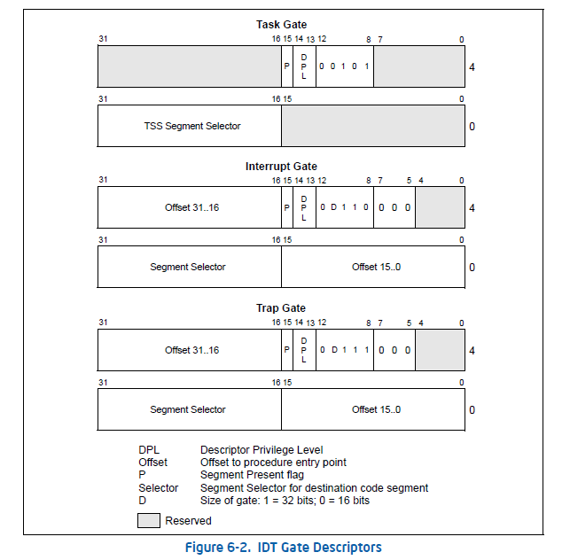

# Lab1 实验报告
### 练习一
1. 操作系统镜像文件ucore.img是如何一步一步生成的？(需要比较详细地解释Makefile中每一条相关命令和命令参数的含义，以及说明命令导致的结果)
    1. gcc 编译参数为 `CFCFLAGS  := -fno-builtin -Wall -ggdb -m32 -gstabs -nostdinc` `CFLAGS  += $(shell $(CC) -fno-stack-protector -E -x c /dev/null >/dev/null 2>&1 && echo -fno-stack-protector)`，其中有几条参数比较特殊:
        - `-fno-builtin` 表示只将带 `__builtin_` 前缀的函数视为内建函数并进行优化。
        - `-ggdb` 生成 gdb 调试信息，与平常所用的 `-g` 不同的是 `-g` 是 "OS native format" 的，可供其他调试器使用; 而 `-ggdb` 生成的是供 gdb 使用的，与平台无关，可跨平台调试，因此这里使用 `-ggdb` 。
        - `-gstabs` 生成 stabs 调试信息，在 gdb 调试信息之上可以附加 "自动变量、全局变量、寄存器变量、静态变量和函数参数" 方便调试。
        - `-m32` 生成 32 位代码，以便在 i386 CPU 上运行。
        - `-nostdinc` 不在标准系统目录中搜索头文件，可以使用自定义的头文件，避免调用标准库。
        - `-fno-stack-protector`  不使用编译器堆栈保护技术。
    2. 调用 ```$(call add_files_cc,$(call listf_cc,$(KSRCDIR)),kernel,$(KCFLAGS)) ``` 执行编译 ```KSRCDIR += kern/init kern/libs kern/debug kern/driver kern/trap kern/mm``` 中的.c文件并生成.o文件
    3. 调用 ```$(V)$(LD) $(LDFLAGS) -T tools/kernel.ld -o $@ $(KOBJS)``` 使用 `tools/kernel.ld` 作为链接脚本链接 `步骤2` 中生成的 `.o` 文件，并输出至 `bin/kernel`。其中 `-T` 参数的作用是"读取链接脚本"，`-m elf_i386` 为在 i386 平台下的链接。
    4. 调用 ```bootfiles = $(call listf_cc,boot)
$(foreach f,$(bootfiles),$(call cc_compile,$(f),$(CC),$(CFLAGS) -Os -nostdinc))``` 编译出 `obj/boot/bootasm.o`和 `obj/boot/bootmain.o`。
    5. 调用 ```$(call add_files_host,tools/sign.c,sign,sign)
$(call create_target_host,sign,sign)``` 生成 `bin/sign`
    6. 调用 ```$(V)$(LD) $(LDFLAGS) -N -e start -Ttext 0x7C00 $^ -o $(call toobj,bootblock)``` 链接 `步骤4` 中生成的 `.o` 文件，并输出到 `obj/bootblock.o`。 `-Ttext 0x7C00` 表示将初始地址重定向为0x7c00。
    7. 调用 ```	@$(OBJCOPY) -S -O binary $(call objfile,bootblock) $(call outfile,bootblock)
	@$(call totarget,sign) $(call outfile,bootblock) $(bootblock)``` 使用 sign 工具对 `obj/bootblock.o` 签名，输出至 `bin/bookblock` 。
    8. `dd if=/dev/zero of=bin/ucore.img count=10000` 创建镜像文件 `bin/ucore.img` 大小10000个512字节的块。
    9. `dd if=bin/bootblock of=bin/ucore.img conv=notrunc` 将 `bootblock` 写入镜像的第一个块。
    10. `dd if=bin/kernel of=bin/ucore.img seek=1 conv=notrunc` 将 `kernel` 写入镜像第二个块起始的空间。

2. 一个被系统认为是符合规范的硬盘主引导扇区的特征是什么?
   - 共 512 字节长，第 511 字节是 `0x55` ，第 512 个字节是 `0xAA` ，即最后两个字节是 `0x55AA` 。

### 练习二

1. 从CPU加电后执行的第一条指令开始，单步跟踪BIOS的执行。
    1. 修改 `tool/gdbinit` 如下：
    ```asm
   define hook-stop
   x/i $pc
   end
   target remote :1234
    ```
    2. 运行 `make debug` 开始调试。
    3. 执行 `set architecture i8086` 切换至 i8086 模式。
    4. 执行 `x /2i 0xffff0` 和 `x /10i 0xfe05b` 。运行结果如下：
    ```asm
    (gdb) x /2i 0xffff0
       0xffff0:	ljmp   $0xf000,$0xe05b
       0xffff5:	xor    %dh,0x322f
    (gdb) x /10i 0xfe05b
       0xfe05b:	cmpl   $0x0,%cs:0x6c48
       0xfe062:	jne    0xfd2e1
       0xfe066:	xor    %dx,%dx
       0xfe068:	mov    %dx,%ss
       0xfe06a:	mov    $0x7000,%esp
       0xfe070:	mov    $0xf3691,%edx
       0xfe076:	jmp    0xfd165
       0xfe079:	push   %ebp
       0xfe07b:	push   %edi
       0xfe07d:	push   %esi

    ```
2. 在初始化位置0x7c00 设置实地址断点,测试断点正常。
    1. 运行 `make debug` 开始调试。
    2. 执行 `b *0x7c00` 设置断点。
    3. 执行 `c` 跳转至 `bootloader` 起始地址。
    4. 执行 `si` 单步调试如下：
    ```asm
    (gdb) c
    Continuing.
    => 0x7c00:      cli
    Breakpoint 1, 0x00007c00 in ?? ()
    (gdb) si
    => 0x7c01:      cld
    0x00007c01 in ?? ()
    => 0x7c02:      xor    %eax,%eax
    0x00007c02 in ?? ()
    => 0x7c04:      mov    %eax,%ds
    0x00007c04 in ?? ()
    => 0x7c06:      mov    %eax,%es
    0x00007c06 in ?? ()
    => 0x7c08:      mov    %eax,%ss
    ```
3. 从0x7c00开始跟踪代码运行,将单步跟踪反汇编得到的代码与bootasm.S和 bootblock.asm进行比较。
    在 `0x7c00` 单步执行，结果如下：
    ```asm
    (gdb) c
    Continuing.
    => 0x7c00:	cli    
    Breakpoint 1, 0x00007c00 in ?? ()
    (gdb) si
    => 0x7c01:	cld    
    0x00007c01 in ?? ()
    (gdb)
    => 0x7c02:	xor    %eax,%eax
    0x00007c02 in ?? ()
    (gdb)
    => 0x7c04:	mov    %eax,%ds
    0x00007c04 in ?? ()
    (gdb)
    => 0x7c06:	mov    %eax,%es
    0x00007c06 in ?? ()
    (gdb)
    => 0x7c08:	mov    %eax,%ss
    0x00007c08 in ?? ()
    (gdb)
    => 0x7c0a:	in     $0x64,%al
    0x00007c0a in ?? ()
    (gdb)
    => 0x7c0c:	test   $0x2,%al
    0x00007c0c in ?? ()
    (gdb)
    => 0x7c0e:	jne    0x7c0a
    0x00007c0e in ?? ()
    (gdb)
    => 0x7c10:	mov    $0xd1,%al
    0x00007c10 in ?? ()
    (gdb)
    => 0x7c12:	out    %al,$0x64
    0x00007c12 in ?? ()
    (gdb)
    => 0x7c14:	in     $0x64,%al
    0x00007c14 in ?? ()
    (gdb)
    => 0x7c16:	test   $0x2,%al
    0x00007c16 in ?? ()
    (gdb)
    => 0x7c18:	jne    0x7c14
    0x00007c18 in ?? ()
    (gdb)
    => 0x7c1a:	mov    $0xdf,%al
    0x00007c1a in ?? ()
    (gdb)
    => 0x7c1c:	out    %al,$0x60
    0x00007c1c in ?? ()
    (gdb)
    => 0x7c1e:	lgdtl  (%esi)
    0x00007c1e in ?? ()
    (gdb)
    => 0x7c23:	mov    %cr0,%eax
    0x00007c23 in ?? ()
    (gdb)
    => 0x7c26:	or     $0x1,%ax
    0x00007c26 in ?? ()
    (gdb)
    => 0x7c2a:	mov    %eax,%cr0
    0x00007c2a in ?? ()
    (gdb)
    => 0x7c2d:	ljmp   $0xb866,$0x87c32
    0x00007c2d in ?? ()
    (gdb)
    => 0x7c32:	mov    $0x10,%ax
    0x00007c32 in ?? ()
    (gdb)
    => 0x7c36:	mov    %eax,%ds
    0x00007c36 in ?? ()
    (gdb)
    => 0x7c38:	mov    %eax,%es
    0x00007c38 in ?? ()
    (gdb)
    => 0x7c3a:	mov    %eax,%fs
    0x00007c3a in ?? ()
    (gdb)
    => 0x7c3c:	mov    %eax,%gs
    0x00007c3c in ?? ()
    (gdb)
    => 0x7c3e:	mov    %eax,%ss
    0x00007c3e in ?? ()
    (gdb)
    => 0x7c40:	mov    $0x0,%ebp
    0x00007c40 in ?? ()
    (gdb)
    => 0x7c45:	mov    $0x7c00,%esp
    0x00007c45 in ?? ()
    (gdb)
    => 0x7c4a:	call   0x7d0d
    0x00007c4a in ?? ()
    (gdb)
    => 0x7d0d:	push   %ebp
    0x00007d0d in ?? ()
    (gdb)
    => 0x7d0e:	xor    %ecx,%ecx
    0x00007d0e in ?? ()
    (gdb)
    => 0x7d10:	mov    $0x1000,%edx
    0x00007d10 in ?? ()
    (gdb)
    => 0x7d15:	mov    $0x10000,%eax
    0x00007d15 in ?? ()
    (gdb)
    => 0x7d1a:	mov    %esp,%ebp
    0x00007d1a in ?? ()
    (gdb)
    => 0x7d1c:	push   %esi
    0x00007d1c in ?? ()
    (gdb)
    => 0x7d1d:	push   %ebx
    0x00007d1d in ?? ()
    (gdb)
    => 0x7d1e:	call   0x7c72
    0x00007d1e in ?? ()
    (gdb)
    => 0x7c72:	push   %ebp
    0x00007c72 in ?? ()
    (gdb)
    => 0x7c73:	mov    %esp,%ebp
    0x00007c73 in ?? ()
    (gdb)
    => 0x7c75:	push   %edi
    0x00007c75 in ?? ()
    (gdb)
    => 0x7c76:	lea    (%eax,%edx,1),%edi
    0x00007c76 in ?? ()
    (gdb)
    => 0x7c79:	mov    %ecx,%edx
    0x00007c79 in ?? ()
    (gdb)
    => 0x7c7b:	shr    $0x9,%ecx
    0x00007c7b in ?? ()
    (gdb)
    => 0x7c7e:	push   %esi
    0x00007c7e in ?? ()
    (gdb)
    => 0x7c7f:	and    $0x1ff,%edx
    0x00007c7f in ?? ()
    (gdb)
    => 0x7c85:	lea    0x1(%ecx),%esi
    0x00007c85 in ?? ()
    (gdb)
    => 0x7c88:	push   %ebx
    0x00007c88 in ?? ()
    (gdb)
    => 0x7c89:	sub    %edx,%eax
    0x00007c89 in ?? ()
    (gdb)
    => 0x7c8b:	push   %ebx
    0x00007c8b in ?? ()
    ```
    与 `bootblock.asm` 一致，其中在 `=> 0x7c4a:	call   0x7d0d` 跳转至 `void bootmain(void)` 在 `=> 0x7d1e:	call   0x7c72` 跳转至 `static void readseg(uintptr_t va, uint32_t count, uint32_t offset)`

4. 自己找一个bootloader或内核中的代码位置，设置断点并进行测试
    设置断点为 `0x7d0d` ，调试信息如下：
    ```asm
    (gdb) b *0x7d0d
    Breakpoint 1 at 0x7d0d
    (gdb) c
    Continuing.
    => 0x7d0d:	push   %ebp

    Breakpoint 1, 0x00007d0d in ?? ()
    (gdb) si
    => 0x7d0e:	xor    %ecx,%ecx
    0x00007d0e in ?? ()
    (gdb)
    => 0x7d10:	mov    $0x1000,%edx
    0x00007d10 in ?? ()
    (gdb)
    => 0x7d15:	mov    $0x10000,%eax
    0x00007d15 in ?? ()
    (gdb)
    => 0x7d1a:	mov    %esp,%ebp
    0x00007d1a in ?? ()
    (gdb)
    => 0x7d1c:	push   %esi
    0x00007d1c in ?? ()
    (gdb)
    => 0x7d1d:	push   %ebx
    0x00007d1d in ?? ()
    (gdb) si
    => 0x7d1e:	call   0x7c72
    0x00007d1e in ?? ()
    ```
    与 `bootblock.asm` 如下代码一致。
    ```asm
    00007d0d <bootmain>:

    /* bootmain - the entry of bootloader */
    void
    bootmain(void) {
        7d0d:	55                   	push   %ebp
        // read the 1st page off disk
        readseg((uintptr_t)ELFHDR, SECTSIZE * 8, 0);
        7d0e:	31 c9                	xor    %ecx,%ecx
        7d10:	ba 00 10 00 00       	mov    $0x1000,%edx
        7d15:	b8 00 00 01 00       	mov    $0x10000,%eax
        }
    }

    /* bootmain - the entry of bootloader */
    void
    bootmain(void) {
        7d1a:	89 e5                	mov    %esp,%ebp
        7d1c:	56                   	push   %esi
        7d1d:	53                   	push   %ebx
        // read the 1st page off disk
        readseg((uintptr_t)ELFHDR, SECTSIZE * 8, 0);
        7d1e:	e8 4f ff ff ff       	call   7c72 <readseg>
        ......
    ```

### 练习3：分析bootloader进入保护模式的过程
1. 首先初始化

    ```asm
    cli                                             # 关中断
    cld                                             # 控制方向标志寄存器DF=0，使得内存地址从低到高增加
    xorw %ax, %ax                                   # 初始化段寄存器
    movw %ax, %ds                                   
    movw %ax, %es                                   
    movw %ax, %ss                                   
    ```

2. 开启A20地址线

    ```asm
    seta20.1:
        inb $0x64, %al                                  # 等待8042控制器
        testb $0x2, %al
        jnz seta20.1
        movb $0xd1, %al                                 # 向0x64端口写0xd1
        outb %al, $0x64                                 
    seta20.2:
        inb $0x64, %al                                  # 等待8042控制器
        testb $0x2, %al
        jnz seta20.2
        movb $0xdf, %al                                 # 向0x60端口写0xdf
        outb %al, $0x60                                 
    ```asm

3. 初始化 GDT

    ```asm
    lgdt gdtdesc
    ```

4. 启动保护模式

    ```asm
    .set CR0_PE_ON,             0x1                     
    movl %cr0, %eax
    orl $CR0_PE_ON, %eax                                # 将 cr0 寄存器最低位置1
    movl %eax, %cr0
    ```

5. 长跳转至 32 位模式

    ```asm
    .set PROT_MODE_CSEG,        0x8                     
    ljmp $PROT_MODE_CSEG, $protcseg
    ```

6. 设置 32 位段寄存器

    ```asm
    .set PROT_MODE_DSEG,        0x10                    
    movw $PROT_MODE_DSEG, %ax                           
    movw %ax, %ds                                       
    movw %ax, %es                                       
    movw %ax, %fs                                       
    movw %ax, %gs                                       
    movw %ax, %ss                                       
    ```

7. 建立栈指针

    ```asm
    movl $0x0, %ebp                                     # ebp = 0
    movl $start, %esp                                   # esp = 0x7c00
    ```

8. 进入 c 入口

    ```asm
    call bootmain
    ```

### 练习4：分析bootloader加载ELF格式的OS的过程

1. 调用 bootmain 函数加载 ELF

    ```c
    void
    bootmain(void) {
        // 读取 EFL 头部
        readseg((uintptr_t)ELFHDR, SECTSIZE * 8, 0);

        // 通过 ELF_MAGIC 判断时候为合法 EFL
        if (ELFHDR->e_magic != ELF_MAGIC) {
            goto bad;
        }

        struct proghdr *ph, *eph;

        // 将 EFL 描述表读入 ph， eph 结束
        ph = (struct proghdr *)((uintptr_t)ELFHDR + ELFHDR->e_phoff);
        eph = ph + ELFHDR->e_phnum;
        for (; ph < eph; ph ++) {
            // 从 ph->p_offset 读取 ph->p_memsz 到 ph->p_va
            readseg(ph->p_va & 0xFFFFFF, ph->p_memsz, ph->p_offset);
        }

        // 进入内核入口
        ((void (*)(void))(ELFHDR->e_entry & 0xFFFFFF))();

    bad:
        outw(0x8A00, 0x8A00);
        outw(0x8A00, 0x8E00);

        while (1);
    }

    ```

2. readseg 函数

    ```c
    static void
    readseg(uintptr_t va, uint32_t count, uint32_t offset) {
        uintptr_t end_va = va + count;

        // 移动 va 至从扇区起始位置读取
        va -= offset % SECTSIZE;

        // 计算起始扇区，kernel 从 1 号开始
        uint32_t secno = (offset / SECTSIZE) + 1;

        // 读取扇区
        for (; va < end_va; va += SECTSIZE, secno ++) {
            readsect((void *)va, secno);
        }

    }
    ```

2. readsect 函数

    ```c
    readsect(void *dst, uint32_t secno) {
        // 等待硬盘
        waitdisk();

        outb(0x1F2, 1);                                 // 设置读取 1 个扇区
        outb(0x1F3, secno & 0xFF);                      // 设置扇区编号
        outb(0x1F4, (secno >> 8) & 0xFF);
        outb(0x1F5, (secno >> 16) & 0xFF);
        outb(0x1F6, ((secno >> 24) & 0xF) | 0xE0);      //置最高 4 位为 1110
        outb(0x1F7, 0x20);                              // 0x20 读取扇区

        // 等待硬盘
        waitdisk();

        // 将结果写入 dst
        insl(0x1F0, dst, SECTSIZE / 4);
    }
    ```

### 练习5：实现函数调用堆栈跟踪函数
    大概按照注释的内容进行补充，如下：
    ```c
    void
    print_stackframe(void) {
        uint32_t ebp = read_ebp(), eip = read_eip(), i;
        for(i=0;ebp!=0 && i<STACKFRAME_DEPTH;i++)
        {
            cprintf("ebp:0x%08x eip:0x%08x args: 0x%08x 0x%08x 0x%08x 0x%08x\n", ebp, eip, *((uint32_t *)ebp+2), *((uint32_t *)ebp+3), *((uint32_t *)ebp+4), *((uint32_t *)ebp+5));
            print_debuginfo(eip-1);
            eip = *((uint32_t *)ebp+1);
            ebp = *(uint32_t *)ebp;
        }
    }
    ```
    运行结果如下：
    ```
    ebp:0x00007b38 eip:0x00100a28 args: 0x00010094 0x00010094 0x00007b68 0x0010007f
        kern/debug/kdebug.c:293: print_stackframe+22
    ebp:0x00007b48 eip:0x00100cfa args: 0x00000000 0x00000000 0x00000000 0x00007bb8
        kern/debug/kmonitor.c:125: mon_backtrace+10
    ebp:0x00007b68 eip:0x0010007f args: 0x00000000 0x00007b90 0xffff0000 0x00007b94
        kern/init/init.c:48: grade_backtrace2+19
    ebp:0x00007b88 eip:0x001000a1 args: 0x00000000 0xffff0000 0x00007bb4 0x00000029
        kern/init/init.c:53: grade_backtrace1+27
    ebp:0x00007ba8 eip:0x001000be args: 0x00000000 0x00100000 0xffff0000 0x00100043
        kern/init/init.c:58: grade_backtrace0+19
    ebp:0x00007bc8 eip:0x001000df args: 0x00000000 0x00000000 0x00000000 0x00103240
        kern/init/init.c:63: grade_backtrace+26
    ebp:0x00007be8 eip:0x00100050 args: 0x00000000 0x00000000 0x00000000 0x00007c4f
        kern/init/init.c:28: kern_init+79
    ebp:0x00007bf8 eip:0x00007d6e args: 0xc031fcfa 0xc08ed88e 0x64e4d08e 0xfa7502a8
        <unknow>: -- 0x00007d6d --
    ```
    最后一行是 bootmain 函数，栈基地址为 0x7c00 ，进入 bootmain 函数压栈，ebp 变为 0x7bf8。

### 练习6：完善中断初始化和处理

1. 中断描述符表（也可简称为保护模式下的中断向量表）中一个表项占多少字节？其中哪几位代表中断处理代码的入口？
    中断描述符表中一个表项占8字节，23字节选择段，01字节表示段低位偏移量，67字节表示段高位偏移量。如图：
    
2. 请编程完善kern/trap/trap.c中对中断向量表进行初始化的函数idt_init。在idt_init函数中，依次对所有中断入口进行初始化。使用mmu.h中的SETGATE宏，填充idt数组内容。每个中断的入口由tools/vectors.c生成，使用trap.c中声明的vectors数组即可。
    如下所示：
    ```c
    void
    idt_init(void) {
        extern uintptr_t __vectors[];
        int i;
        for(i=0;i<256;i++)
        {
            SETGATE(idt[i], 0, GD_KTEXT, __vectors[i], DPL_KERNEL);
        }
        lidt(&idt_pd);
    }
    ```
3. 请编程完善trap.c中的中断处理函数trap，在对时钟中断进行处理的部分填写trap函数中处理时钟中断的部分，使操作系统每遇到100次时钟中断后，调用print_ticks子程序，向屏幕上打印一行文字”100 ticks”。
    如下所示：
    ```c
    case IRQ_OFFSET + IRQ_TIMER:
        if (++ticks%TICK_NUM == 0)
        {
            ticks = 0;
            print_ticks();
        }
        break;
    ```

    运行结果为：
    ```
    ++ setup timer interrupts
    100 ticks
    100 ticks
    100 ticks
    100 ticks
    100 ticks
    100 ticks
    100 ticks
    kbd [055] 7
    100 ticks
    kbd [055] 7
    kbd [055] 7
    100 ticks
    kbd [055] 7
    kbd [097] a
    ```
### 扩展练习 Challenge 1
1. 实现 `lab1_switch_to_user` 和 `lab1_switch_to_kernel`
    代码如下：
    ```c
    static void
    lab1_switch_to_user(void) {
        asm volatile (
            "sub $0x8, %%esp;"
            "int %0;"
            "movl %%ebp, %%esp;"
            :
            : "i"(T_SWITCH_TOU)
        );
    }

    static void
    lab1_switch_to_kernel(void) {
        asm volatile (
            "sub $0x8, %%esp;"
            "int %0;"
            "movl %%ebp, %%esp;"
            :
            : "i"(T_SWITCH_TOK)
        );
    }
    ```
    自己实现的版本一直出现问题，所以这段代码借鉴了答案中的部分，答案中提及 "从中断返回时，会多pop两位，并用这两位的值更新ss,sp，损坏堆栈"，所以要 `esp - 8`。

2. 实现用户态函数
    ```c
    static void user_print_ticks() {
        cprintf("user mode print %d ticks\n", ticks);
    }
    ```
    在这里直接输出了全局变量ticks，理论上应该通过syscall来实现。
3. 在 `idt_init` 增加用户态中断 `T_SWITCH_TOK`
    ```c
    idt_init(void) {
        ......
        SETGATE(idt[T_SWITCH_TOK], 0, GD_KTEXT, __vectors[T_SWITCH_TOK], DPL_USER);
        ......
    }
    ```
4. 实现 `trap_dispatch` 中的中断代码
    ```c
    case T_SWITCH_TOU:
        tf->tf_cs = USER_CS;
        tf->tf_ds = USER_DS;
        tf->tf_es = USER_DS;
        tf->tf_ss = USER_DS;
        tf->tf_eflags |= FL_IOPL_MASK;
        cprintf("TtoU\n");
        break;
    case T_SWITCH_TOK:
        tf->tf_cs = KERNEL_CS;
        tf->tf_ds = KERNEL_DS;
        tf->tf_es = KERNEL_DS;
        tf->tf_eflags &= ~FL_IOPL_MASK;
        cprintf("TtoK\n");
        break;
    ```
    通过切换代码段、数据段的信息来切换用户态/内核态，注意额外修改 io 权限 `tf->tf_eflags`。

5. 运行 `make qemu` 得到结果
    ```
    Check Output:            (2.3s)
    -check ring 0:                             OK
    -check switch to ring 3:                   OK
    -check switch to ring 0:                   OK
    -check ticks:                              OK
    Total Score: 40/40
    ```
### 扩展练习 Challenge 2
1. 实现 `check_mode` 判断当前用户态
    ```c
    static bool is_kernel_mode(struct trapframe *tf)
    {
        if (tf->tf_cs == 0x8 &&
            tf->tf_ds == 0x10 &&
            tf->tf_es == 0x10)
            return 1;
        else
            return 0;
    }

    static bool is_user_mode(struct trapframe *tf)
    {
        if (tf->tf_cs == 0x1b &&
            tf->tf_ds == 0x23 &&
            tf->tf_es == 0x23 &&
            tf->tf_ss == 0x23)
            return 1;
        else
            return 0;
    }

    static void check_mode(struct trapframe *tf)
    {
        if(is_user_mode(tf))
            cprintf("User Mode\n");
        else if(is_kernel_mode(tf))
            cprintf("Kernel Mode\n");
        else
            panic("Mode Error\n");
    }
    ```
    通过 `trapframe` 中的段状态来判断用户态
2. 修改 `trap_dispatch` 中的中断代码
    ```c
    case IRQ_OFFSET + IRQ_KBD:
        c = cons_getc();
        cprintf("kbd [%03d] %c\n", c, c);
        if (c == '3')
        {
            check_mode(tf);
            tf->tf_cs = USER_CS;
            tf->tf_ds = USER_DS;
            tf->tf_es = USER_DS;
            tf->tf_ss = USER_DS;
            tf->tf_eflags |= FL_IOPL_MASK;
            cprintf("Changing Mode\n");
            check_mode(tf);
        }else if(c == '0')
        {
            check_mode(tf);
            tf->tf_cs = KERNEL_CS;
            tf->tf_ds = KERNEL_DS;
            tf->tf_es = KERNEL_DS;
            tf->tf_eflags &= ~FL_IOPL_MASK;
            cprintf("Changing Mode\n");
            check_mode(tf);
        }
        break;
    ```
    判断键盘输入是否为 `3` 和 `0`，并切换状态，check_mode(tf)输出当前状态;
3. 测试结果如下
    ```
    100 ticks
    kbd [051] 3
    Kernel Mode
    Changing Mode
    User Mode
    kbd [000]
    100 ticks
    kbd [048] 0
    User Mode
    Changing Mode
    Kernel Mode
    kbd [000]

    100 ticks
    kbd [048] 0
    Kernel Mode
    Changing Mode
    Kernel Mode
    kbd [000]
    100 ticks
    kbd [051] 3
    Kernel Mode
    Changing Mode
    User Mode
    kbd [000]
    100 ticks
    kbd [051] 3
    User Mode
    Changing Mode
    User Mode
    kbd [000]
    ```
